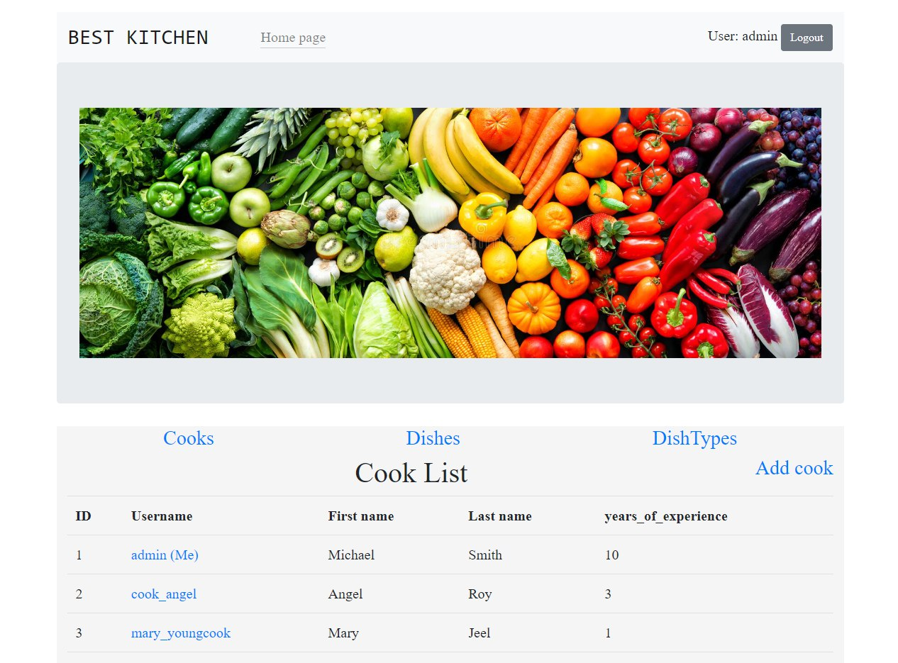

# Kitchen-project
Django kitchen management project

#### Checkout it

[Kitchen service project deployed to Render](link)

 #### Features

* Authentication functionality for Cook/User
* Managing dishes/dish_type from website interface
* Powerful admin panel for advanced managing

#### Test user

* User: `admin`
* Password: `2105Inna75`

#### Demo


#### Installation
##### Python3 must be already installed.

```
git clone  https://github.com/InnaKushnir/my-django-project.git

cd my-project

python -m venv venv

source venv/bin/activate

pip install -r requirements.txt

python manage.py runserver 
```